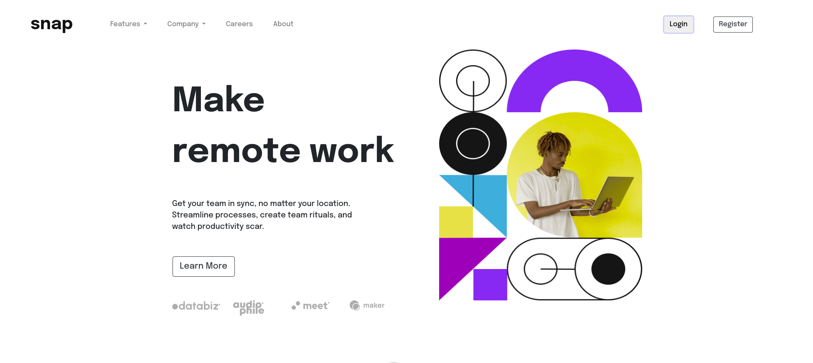

# Frontend Mentor - Intro section with dropdown navigation solution

This is a solution to the [Intro section with dropdown navigation challenge on Frontend Mentor](https://www.frontendmentor.io/challenges/intro-section-with-dropdown-navigation-ryaPetHE5). Frontend Mentor challenges help you improve your coding skills by building realistic projects. 

## Table of contents

- [Overview](#overview)
  - [The challenge](#the-challenge)
  - [Screenshot](#screenshot)
  - [Links](#links)
- [My process](#my-process)
  - [Built with](#built-with)
  - [What I learned](#what-i-learned)
  - [Continued development](#continued-development)
  - [Useful resources](#useful-resources)
- [Author](#author)

## Overview

### The challenge

Users should be able to:

- View the relevant dropdown menus on desktop and mobile when interacting with the navigation links
- View the optimal layout for the content depending on their device's screen size
- See hover states for all interactive elements on the page

### Screenshot



### Links

- Solution URL: [Landing Page](https://github.com/Manas-Anjalekar/landingPage.git)
- Live Site URL: [Landing Page](https://)

## My process

### Built with

- Semantic HTML5 markup
- CSS custom properties
- Flexbox
- CSS Grid
- Mobile-first workflow
- [Ruby on Rails](https://guides.rubyonrails.org/getting_started.html) - Framework
- [Bootstrap](https://getbootstrap.com/docs/4.0/getting-started/introduction/) - For styles


### What I learned

Use this section to recap over some of your major learnings while working through this project. Writing these out and providing code samples of areas you want to highlight is a great way to reinforce your own knowledge.


```html
<div class="container" style="font-family: 'Epilogue', sans-serif;">
  <div class="row">
    <div class="col mr-2 p-3">
      <div class="row my-5" style="font-weight: 700; font-size: 80px;"><div class="container">Make</div><div class="container">remote work</div></div>
      <div class="row my-5" style="font-size: 18px;"><div class="container">Get your team in sync, no matter your location.</div><div class="container">Streamline processes, create team rituals, and</div><div class="container">watch productivity scar.</div></div>
      <div class="row my-5"><button class="btn btn-outline-dark my-2  ml-3 btn-lg" type="submit">Learn More</button></div>
      <div class="row my-5">
        <div class="col"><%= image_tag("client-databiz.svg") %></div>
        <div class="col"><%= image_tag("client-audiophile.svg") %></div>
        <div class="col"><%= image_tag("client-meet.svg") %></div>
        <div class="col"><%= image_tag("client-maker.svg") %></div>
      </div>
    </div>
    <div class="col ml-3">
      <%= image_tag("image-hero-desktop.png", size: "527x593", class: "pl-5") %>
    </div>
  </div>
```

```ruby
<%= image_tag("icon-todo.svg",class:"mr-3") %>
```

### Continued development

I had previously worked with AsiaToJapan Labs Pvt.Ltd. for 6 months as a Web Development Intern which introduced me to Fullstack Web-Development domain. Thanks to the team at AsiaToJapan Labs Pvt.Ltd., I was able to learn and really grasp the basics of RubyonRails through extensive practice.

As a Robotics and Automation Engineer, I think most of the people in this domain are not introduced to this domain which is why I would like to go forward and continue developing various projects, both frontend and backend to supplement my growth as well as contribute to the community through automation solution with amazing webpage solutions.

Looking forward to the feedback on this one and support for the upcoming projects!

### Useful resources

- [Bootstrap Documentation](https://getbootstrap.com/docs/4.0/getting-started/introduction/) - This helped me for styling the webpage. I really like this framework and will use it going forward.
- [Mobile Viewport with RoR](https://medium.com/@biancapower/why-your-rails-site-with-bootstrap-might-not-display-correctly-on-mobile-devices-48873aaeaf68) - This is an amazing article which helped me finally understand viewport and how to make a responsive design. I'd recommend it to anyone still learning this concept.
- [Image Tag with RailsAssetHelpers](https://api.rubyonrails.org/classes/ActionView/Helpers/AssetTagHelper.html#method-i-image_tag) - This helped in clearing my basics regarding image_tags and favicon_tags.

## Author

- Website - [Manas Anjalekar | アンジャレカル・マナス](https://)
- Frontend Mentor - [@Manas-Anjalekar](https://www.frontendmentor.io/profile/Manas-Anjalekar) 
- Linkedin - [@Manas-Anjalekar](https://linkedin.com/in/manas-anjalekar)


